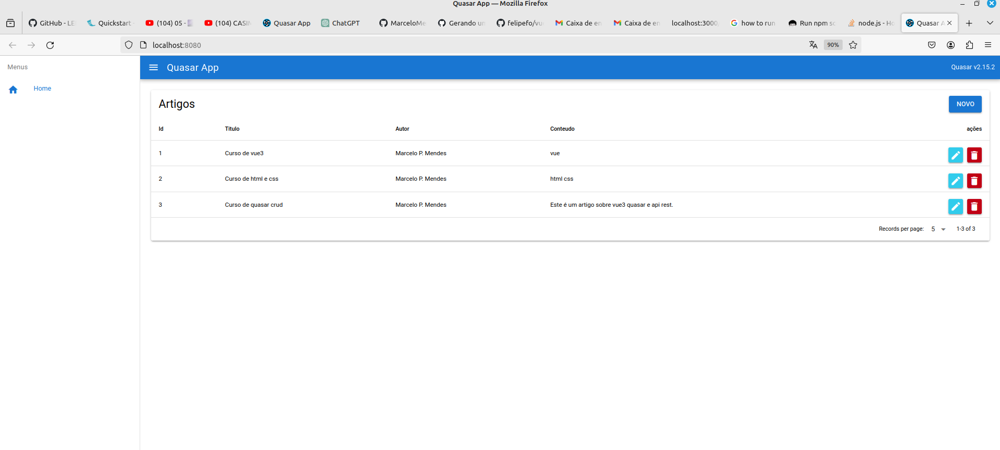

# first-project-vue-quasar
Projeto feito de seguindo o tutorial do [Patrick Monteiro](https://github.com/patrickmonteiro) no youtube [link](https://www.youtube.com/watch?v=8Qz1ONUlZDM&list=PLBjvYfV_TvwKsZMouKKzBdyjiZnA-XHrn&index=1) utilizando Quasar framework 

<hr>

1. ligar o servidor de fake api
```
npx json-server api-crud-vue3/db.json 
```
2. iniciar aplicação em dev
```
npm run dev --prefix ./quasar-project/
```

<hr>

## Captura de tela
